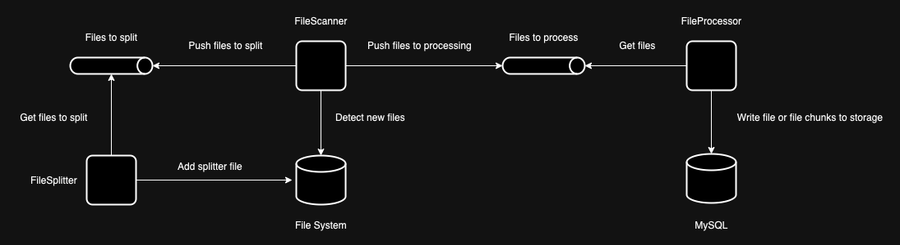

# Coding task for {company_name} interview

The task is to implement an application that
- receives a .CSV file in a designated folder
- saves it to the data storage
- provides an HTTP REST API that allows querying the data by a GET request for a specific ID

## Description

The .CSV file contains three columns:
- id - a UUID field
- price - a floating point number with high precision
- expiration_date - a timestamp with a timezone

The .CSV file can potentially be large and contain billions of rows.

The application expects all IDs to be unique.

Also, the HTTP REST API can receive a high load (millions of requests per minute).


## Implementation details

### How to run

#### Prerequisites

In order to run this app, you'll need Go 1.20 and a MySQL instance installed on your machine.

Or you can use the provided docker-compose configuration that handles everything (you'll need to have Docker installed on your machine).

#### Run without Docker

The application consists of two executables:
- HTTP API server that accepts HTTP requests
- File processor

Also, there is an additional tool to generate test data.

In order to build all available executables, you'll need to run this command:
```bash
$ make build
```

Configuration files for both apps are located at [configs directory](./configs):
- API server - [prices_app.yaml](./configs/prices_app.yaml)
- File processor - [files_app.yaml](./configs/files_app.yaml)

To run the API server, you'll need to run this command:
```bash
$ make run-prices
```

To run the File processor, you'll need to run this command:
```bash
$ make run-files
```

### Run with Docker

You'll need to build images for both executables:
```bash
$ make docker-build
```

After that, you can start the application:
```bash
$ make docker-run
```

To see the application logs, you can run this command:
```bash
$ make docker-logs
```

To stop the application, you have two options:

Stop the application and keep DB data:
```bash
$ make docker-stop
```

Stop the application and remove all data:
```bash
$ make docker-stop-clean
```

## How to use

Once you have the application up and running you can start using it.

In order to see the application in action, we'll need some test data.

We can generate it by running this command:
```bash
$ make TEST_DATA_LINES=100 TEST_DATA_OUT=./test generate-test-data
```

This command will generate a .CSV file with valid test data.

If you receive an error:
```
make: ./build/testdata: No such file or directory
make: *** [generate-test-data] Error 1
```

run this command and try again:
```bash
$ make build-test-data
```

Now we have some test data we can feed it to the application.

Copy generated file to the directory specified in `FILES_DIRECTORY` field of [files_app.yaml](./configs/files_app.yaml) (by default it is `./test/data`).

If the application is running and healthy you should see something like this in the logs:
```
fileParser  | {"level":"info","timestamp":"2023-08-24T10:01:40Z","logger":"FilesApp.FileScanner","caller":"files/scanner.go:49","msg":"try to start scanning files in directory=/app/data"}
fileParser  | {"level":"info","timestamp":"2023-08-24T10:01:40Z","logger":"FilesApp.FileScanner","caller":"files/scanner.go:104","msg":"add entry=/app/data/1692870834247604000_test_prices.csv to files queue"}
fileParser  | {"level":"info","timestamp":"2023-08-24T10:01:41Z","logger":"FileProcessor","caller":"files/processor.go:216","msg":"save file=/app/data/1692871300991161491_1692870834247604000_test_prices.csv to storage"}
```

After the file is written to the DB storage we can try to get it through the API:
```bash
$ curl http://localhost:8080/api/v0/prices/promotions/98015680-bf98-4ec5-85a6-2e5f7eee1495 -v
```

You can pick any ID from the generated test data file.

Expected response:
```
*   Trying 127.0.0.1:8080...
* Connected to localhost (127.0.0.1) port 8080 (#0)
> GET /api/v0/prices/promotions/98015680-bf98-4ec5-85a6-2e5f7eee1495 HTTP/1.1
> Host: localhost:8080
> User-Agent: curl/7.87.0
> Accept: */*
> 
* Mark bundle as not supporting multiuse
< HTTP/1.1 200 OK
< Content-Type: application/json; charset=utf-8
< Date: Thu, 24 Aug 2023 10:04:08 GMT
< Content-Length: 104
< 
* Connection #0 to host localhost left intact
{"expiration_date":"2018-09-11T20:47:23Z","id":"98015680-bf98-4ec5-85a6-2e5f7eee1495","price":52.643929}%   
```

### High-Level Description 

The applications is split into two executables with the same codebase.

One is responsible for the .CSV file input (we'll call it `FilesApp`) and the other is a HTTP REST API for the data written by the `FilesApp` (we'll call it `PricesApp`).

This split is created because we may need to scale `FilesApp` and `PricesApp` independently.

#### FilesApp

The `FileApp` consists of three main components:
- **FileScanner**
- **FileSplitter**
- **FileProcessor**

The **FileScanner** monitors the designated folder in the file system and adds new files to a processing queue.

Files can be big. In order to improve the performance, we push big files to a separate queue by splitting them into smaller chunks.

The **FileSplitter** listens for files in the split files queue and splits them according to its configuration, e.g., by 100,000 lines.

The split files are placed back in the scanned folder original folder for the **FileScanner** so it can detect them and push them to the processing queue.

The **FileProcessor** listens for the files in the processing queue and either writes them to the DB storage in batches or imports them to the DB storage as is.
How the **FileProcessor** writes data to the storage is decided by its configuration.




**FileSplitter** and **FileProcessor** have internal workers and can be scaled according to the provided configuration.

#### PricesApp

The `PricesApp` provides simple HTTP REST API.

The OpenAPI schema definition is located in [prices.yaml](./api/openapi/prices/prices.yaml).

[OAPICodeGen](https://github.com/deepmap/oapi-codegen) library is used to generate `.go` stubs for the server implementation.

You can regenerate the `.go` code stubs with this command:
```bash
$ make prices-api
```

The initial task description mentioned the possibility of a high load of concurrent requests to this API.

One way to solve this issue is to use multiple instances of `PricesApp` and set up a load balancer to distribute the incoming requests.

Current Docker-based configurations use Nginx to show an example of this approach (manual load balancing).

You can test it by building and running the Dockerized version of the application:
```bash
$ make docker-build && make docker-run
```

Then if you make many requests to the load balancer:
```bash
$ curl http://localhost:80/api/v0/prices/promotions/22c3be74-4264-11ee-9c24-a45e60d0762b -v
```

in the application logs, you'll see that requests are distributed between multiple instances of the `PricesApp`.